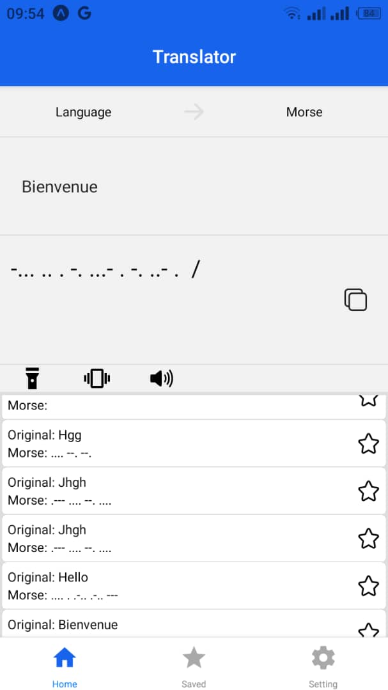
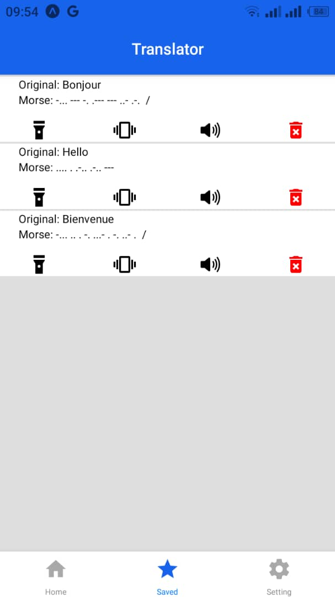
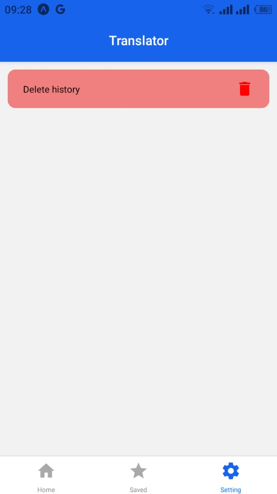

# Morse Converter App

## Description

**MorseCodeTranstor** is a mobile application developed with **React Native Expo** that allows users to convert phrases into Morse code. It features interactive capabilities to emit Morse signals in the form of sound, vibration, and light using the phone's flashlight. The application contains three main pages:

- **Home**: Convert your phrases into Morse code.
- **Favorites**: Save and easily access your favorite translations.
- **Settings**: Configure output options for the signals (sound, vibration, light).

## Screenshots

### 1. Translation Page



### 2. Favorites Page


### 3. Settings Page


## Features

- **Morse Translation**: Enter text and instantly receive the Morse code version.
- **Signal Emission**: 
  - Sound: Listen to the Morse signal as a beeping sound.
  - Vibration: Receive the Morse signal as vibrations.
  - Light: The flashlight on your phone emits the Morse signal.
- **Favorites**: Save your favorite translations for quick access.
- **Customizable Settings**: Configure how you want to receive the signals (sound, vibration, light).

## Installation

1. Make sure you have [Node.js](https://nodejs.org/en/) and [Expo CLI](https://docs.expo.dev/get-started/installation/) installed.
2. Clone this repository to your local machine:

   ```bash
   git clone https://github.com/your-username/morse-converter-app.git
